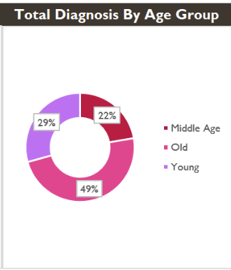

# Demographic and Economic Patterns of Type 2 Diabetes Mellitus Among Patients Attending a Tertiary Hospital in Awka, Nigeria: A Retrospective Hospital-Based Analysis (2023–2024)

## Abstract

Type 2 Diabetes Mellitus (T2DM) remains one of the leading non-communicable diseases contributing to morbidity, mortality, and healthcare expenditure worldwide. Understanding local demographic and economic patterns of diabetes is essential for evidence-based healthcare planning and preventive interventions.

This retrospective hospital-based study analyzed diagnosis records obtained from Amaku Teaching Hospital, Awka, Anambra State, Nigeria, between 2023 and 2024. The study investigated demographic distribution, hospitalization patterns, and treatment-related costs associated with Type 2 Diabetes Mellitus using real-world clinical data.

A total of 341 diabetes diagnosis records representing 256 distinct patients were identified and analyzed. Findings revealed that older adults accounted for the largest proportion of diabetes diagnoses, while notable gender differences were observed across age groups. The study also demonstrated a substantial economic burden associated with diabetes management, with an average treatment cost of approximately ₦50,655 and an average hospitalization duration of 14 days.

The findings provide valuable insight into local diabetes patterns and highlight the importance of early detection, routine screening, and targeted public health interventions aimed at reducing the burden of Type 2 Diabetes Mellitus within the Nigerian healthcare system.

---

## Background

Diabetes Mellitus is a chronic metabolic disorder characterized by elevated blood glucose levels resulting from impaired insulin secretion, insulin action, or both. Type 2 Diabetes Mellitus accounts for the majority of diabetes cases globally and continues to increase in prevalence due to population aging, urbanization, sedentary lifestyles, and dietary changes.

According to reports from the World Health Organization (WHO) and the International Diabetes Federation (IDF), age and gender are important factors influencing diabetes occurrence and disease progression. Several studies have reported increased diabetes burden among older adults and variations in disease patterns between males and females.

Despite increasing diabetes burden in Nigeria, localized hospital-based analyses remain limited. This study was conducted to examine whether demographic patterns observed globally are reflected within a tertiary healthcare setting in Awka, Anambra State.

---

## Study Aim

To evaluate the demographic and economic patterns associated with Type 2 Diabetes Mellitus among patients attending Amaku Teaching Hospital, Awka, Nigeria.

---

## Specific Objectives

1. To determine the age-group distribution of patients diagnosed with Type 2 Diabetes Mellitus.
2. To assess gender-based patterns among diabetic patients.
3. To evaluate treatment costs associated with diabetes management.
4. To assess hospitalization duration among diabetic patients.
5. To generate evidence that may support preventive healthcare planning and diabetes awareness initiatives.

---

## Research Questions

1. Which age group accounted for the highest proportion of Type 2 Diabetes diagnoses?
2. What gender-related patterns were observed among diabetic patients?
3. What economic burden was associated with diabetes treatment?
4. What hospitalization trends were observed among diabetic patients?

---

## Study Design

### Design

Retrospective hospital-based observational study.

### Study Location

Amaku Teaching Hospital, Awka, Anambra State, Nigeria.

### Study Period

January 2023 – December 2024.

### Data Source

Hospital diagnosis records containing multiple disease categories including:

* Type 2 Diabetes Mellitus
* Hypertension
* Malaria
* Influenza
* Asthma

### Inclusion Criteria

* Patients with clearly documented Type 2 Diabetes Mellitus diagnoses.
* Records containing sufficient demographic and treatment information.

### Exclusion Criteria

* Incomplete records.
* Duplicate or unclear entries.
* Records with missing critical variables required for analysis.

---

## Data Processing and Analysis

The original dataset consisted of over 1,500 hospital diagnosis records.

The following preprocessing steps were performed:

* Manual organization and digitization of hospital records.
* Data cleaning and standardization.
* Removal of incomplete entries.
* Identification of unique patients.
* Categorization of patients into age groups.
* Development of interactive analytical dashboards using Microsoft Excel Pivot Tables and visualization tools.

### Age Classification

| Age Group    | Range       |
| ------------ | ----------- |
| Young        | ≤ 30 years  |
| Middle Age   | 31–55 years |
| Older Adults | > 55 years  |

---

## Results

### Study Population

* Total diabetes diagnosis records analyzed: 341
* Total distinct patients identified: 256

### Age Distribution

Analysis revealed that diabetes diagnoses were concentrated among older adults.

| Age Group    | Percentage |
| ------------ | ---------- |
| Older Adults | 49%        |
| Young        | 29%        |
| Middle Age   | 22%        |

### Gender Distribution

Male patients demonstrated higher diagnosis frequencies during younger and middle-age categories, while female diagnoses increased among older adults.

### Treatment Cost

The average treatment cost associated with diabetes management was approximately:

**₦50,655**

### Hospitalization Duration

The average hospitalization duration among diabetic patients was:

**14 days**

### Economic Impact

Estimated hospital revenue generated from diabetes-related treatment exceeded:

**₦17.2 Million**

within the analyzed records.

---

## Discussion

The findings indicate that Type 2 Diabetes Mellitus disproportionately affected older adults within the study population. This observation is consistent with established evidence linking increasing age with insulin resistance, metabolic dysfunction, and higher diabetes risk.

The observed increase in female diagnoses among older adults may reflect hormonal and metabolic changes associated with aging. Similar patterns have been reported in international diabetes literature.

The economic findings further emphasize the financial burden of diabetes management on both healthcare institutions and affected individuals, reinforcing the importance of preventive healthcare strategies and early diagnosis.

---

## Public Health Implications

The study highlights the need for:

* Routine diabetes screening programs.
* Increased public awareness regarding diabetes risk factors.
* Promotion of healthy lifestyle practices.
* Early intervention strategies targeting high-risk populations.
* Strengthened diabetes management programs within healthcare facilities.

---

## Limitations

* Findings are based on records from a single healthcare institution.
* Community-wide prevalence could not be determined from hospital data alone.
* Some records were excluded due to incomplete documentation.
* Results may not fully represent the broader population of Awka or Anambra State.

---

## Future Directions

Future studies should:

* Incorporate multiple healthcare institutions.
* Include larger sample sizes.
* Conduct inferential statistical analyses to assess significance of observed demographic patterns.
* Investigate risk factors associated with diabetes occurrence within local populations.

---

## Tools Used

* Microsoft Excel
* Pivot Tables
* Data Cleaning and Standardization Techniques
* Healthcare Data Analytics
* Interactive Dashboard Development

---

## Author

**Osi Chidera John**

Medical Laboratory Science Student

Nnamdi Azikiwe University, Awka, Nigeria

---

## Acknowledgements

Special appreciation to:

* Dr. Nosa Osakue
* Amaku Teaching Hospital, Awka
* World Health Organization (WHO)
* International Diabetes Federation (IDF)

for providing inspiration and scientific resources relevant to diabetes research.

---

# Dashboard Preview

## Dashboard Overview

---

## Age Group Distribution

---

## Public Health Insights

This project highlights the growing burden of diabetes within local healthcare systems and reinforces the importance of:
- Early screening
- Lifestyle modification
- Routine glucose monitoring
- Public health awareness
- Preventive healthcare strategies

For non-diabetic individuals:
Healthy eating, regular physical activity, and routine medical checkups remain important preventive measures.

For diabetic patients:
Medication adherence, glucose monitoring, exercise, and proper dietary management are essential in reducing complications.

---

## Limitations

- Dataset represents records from a single healthcare institution
- Only Type 2 Diabetes diagnoses with clear documentation were analyzed
- Findings may not fully represent the entire regional population

---

## Author

Osi Chidera John  
Medical Laboratory Science Student  
Nnamdi Azikiwe University, Awka, Nigeria

---

## View Project
[View Here](https://github.com/Osi-Chidera-John/Real-World-Analysis-of-Type-2-Diabetes-Trends-in-Awka-Nigeria/blob/main/Diabetes_Dashboard.xlsx)

---

## License

This project is intended strictly for educational, research, and portfolio purposes.

---
## Linkedln Profile
[View Profile](www.linkedin.com/in/john-chidera-jr-0b6b55319)
