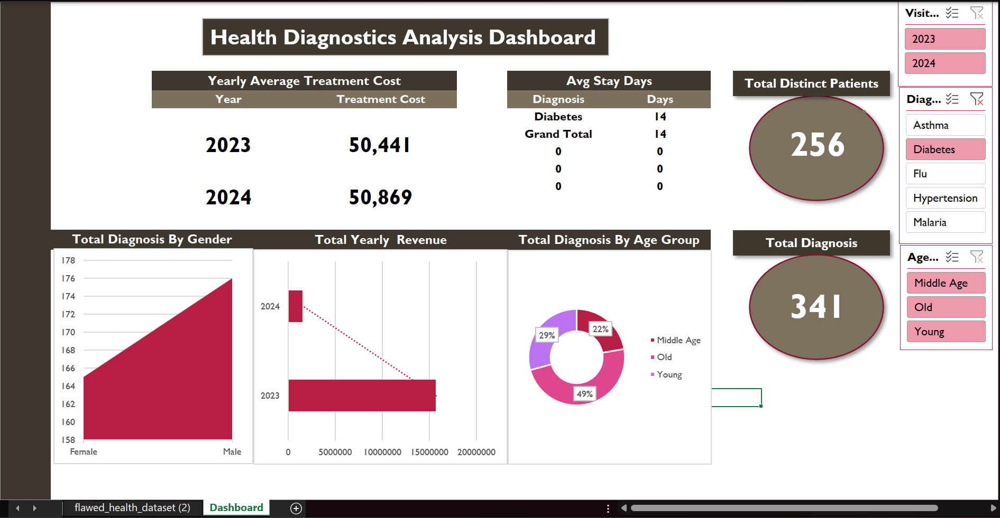

# Demographic and Economic Patterns of Type 2 Diabetes Mellitus Among Patients Attending a Tertiary Hospital in Awka, Nigeria (2023–2024)

## Abstract

Type 2 Diabetes Mellitus (T2DM) remains one of the fastest-growing non-communicable diseases globally, contributing substantially to morbidity, mortality, and healthcare expenditure. Understanding local demographic patterns is essential for effective prevention, early detection, and healthcare planning.

This retrospective hospital-based study analyzed Type 2 Diabetes Mellitus records obtained from Amaku Teaching Hospital, Awka, Anambra State, Nigeria, between January 2023 and February 2024. Using Microsoft Power BI, demographic distributions, hospitalization trends, and treatment-related costs were explored through interactive visual analytics.

A total of **322 diabetes diagnosis records** were identified and analyzed. Older adults represented the highest proportion of cases (**48%**), followed by young adults (**29%**) and middle-aged adults (**23%**). The average treatment cost was approximately **₦52,000**, while the average hospitalization duration was **15 days**.

The findings align with global evidence reported by the World Health Organization (WHO) and International Diabetes Federation (IDF), highlighting age-related increases in diabetes prevalence and important gender-based differences across life stages.

---

## Dashboard Preview

### Overall Dashboard

---

### Young Adults Dashboard (≤30 Years)

---

### Middle-Aged Adults Dashboard (31–55 Years)

---

### Older Adults Dashboard (>55 Years)

---

# Background

Diabetes Mellitus is a chronic metabolic disorder characterized by elevated blood glucose levels resulting from impaired insulin production, insulin action, or both. According to the WHO and IDF, Type 2 Diabetes accounts for approximately 90–95% of all diabetes cases globally.

Ageing, urbanization, sedentary lifestyles, obesity, dietary habits, and hormonal changes are recognized risk factors contributing to increasing diabetes prevalence worldwide.

Despite the growing burden of diabetes in Nigeria, localized hospital-based analyses remain limited. This study was conducted to examine demographic and economic patterns of Type 2 Diabetes Mellitus within a tertiary healthcare setting in Awka, Anambra State.

---

# Study Aim

To evaluate demographic, hospitalization, and economic patterns associated with Type 2 Diabetes Mellitus among patients attending Amaku Teaching Hospital, Awka.

---

# Specific Objectives

* Determine age-group distribution of diabetes diagnoses.
* Assess gender-related patterns across age groups.
* Evaluate treatment costs associated with diabetes management.
* Analyze hospitalization duration trends.
* Develop an interactive Power BI dashboard to support healthcare decision-making.

---

# Research Questions

1. Which age group recorded the highest diabetes burden?
2. What gender-related patterns exist among diabetic patients?
3. What economic burden is associated with diabetes treatment?
4. What hospitalization trends are observed among diabetic patients?

---

# Study Design

### Design

Retrospective Hospital-Based Observational Study

### Study Location

Amaku Teaching Hospital, Awka, Anambra State, Nigeria

### Study Period

January 2023 – February 2024

### Data Source

Hospital diagnosis records containing:

* Type 2 Diabetes Mellitus
* Hypertension
* Malaria
* Asthma
* Influenza
* Other documented diagnoses

---

# Inclusion Criteria

* Confirmed Type 2 Diabetes Mellitus diagnoses.
* Records containing complete demographic and treatment information.

# Exclusion Criteria

* Incomplete records.
* Duplicate entries.
* Records with missing critical variables.

---

# Data Preparation & Analysis

The original hospital dataset contained over 1,500 diagnosis records.

### Data Processing Steps

* Data cleaning and validation
* Standardization of patient records
* Removal of incomplete entries
* Age-group categorization
* Cost aggregation and hospitalization analysis
* Interactive dashboard development using Microsoft Power BI

### Tools Used

* Microsoft Power BI
* Microsoft Excel
* Power Query
* Data Cleaning & Transformation
* Healthcare Data Analytics

---

# Age Classification

| Age Group  | Range       |
| ---------- | ----------- |
| Young      | ≤30 Years   |
| Middle Age | 31–55 Years |
| Old        | >55 Years   |

---

# Results

## Study Population

| Metric                   | Value   |
| ------------------------ | ------- |
| Total Diabetes Diagnoses | 322     |
| Average Treatment Cost   | ₦52,000 |
| Average Hospital Stay    | 15 Days |

---

## Age Distribution

The burden of Type 2 Diabetes was highest among older adults.

| Age Group  | Cases | Percentage |
| ---------- | ----- | ---------- |
| Old        | 156   | 48%        |
| Young      | 92    | 29%        |
| Middle Age | 74    | 23%        |

### Key Finding

Almost one out of every two diabetes diagnoses occurred among older adults, supporting established evidence that diabetes prevalence increases with age.

---

## Gender Patterns Across Age Groups

### Young Adults (≤30 Years)

| Gender | Cases |
| ------ | ----- |
| Male   | 55    |
| Female | 37    |

Young males accounted for a larger proportion of diabetes diagnoses compared with females.

This observation is consistent with findings from WHO reports suggesting that lifestyle factors, obesity, dietary habits, physical inactivity, and earlier exposure to metabolic risk factors can contribute to increased diabetes occurrence among younger males.

---

### Middle-Aged Adults (31–55 Years)

| Gender | Cases |
| ------ | ----- |
| Female | 39    |
| Male   | 35    |

A noticeable increase in female diabetes diagnoses was observed within the middle-aged category.

This pattern aligns with evidence reported in diabetes literature indicating that women approaching menopause (typically around ages 45–55 years) may experience hormonal changes that increase insulin resistance, central adiposity, and metabolic dysfunction, thereby elevating diabetes risk.

---

### Older Adults (>55 Years)

| Gender | Cases |
| ------ | ----- |
| Female | 78    |
| Male   | 78    |

Older adults recorded the highest diabetes burden overall, with virtually identical case counts among males and females.

This finding supports WHO and IDF observations that advancing age is one of the strongest risk factors for Type 2 Diabetes Mellitus, largely due to declining insulin sensitivity, reduced pancreatic β-cell function, and cumulative exposure to metabolic risk factors.

---

## Hospitalization Trends

Average hospitalization duration varied across age groups:

| Age Group  | Average Stay |
| ---------- | ------------ |
| Young      | 13 Days      |
| Middle Age | 19 Days      |
| Old        | 16 Days      |

Middle-aged patients recorded the longest average hospitalization periods, suggesting potentially greater disease complexity or delayed healthcare presentation.

---

## Economic Burden

Treatment costs differed substantially across age groups.

| Age Group  | Average Cost |
| ---------- | ------------ |
| Young      | ₦41,000      |
| Middle Age | ₦60,000      |
| Old        | ₦55,000      |

### Key Insight

Middle-aged patients incurred the highest treatment expenses despite having fewer diagnoses than older adults, suggesting potentially greater treatment intensity and healthcare utilization within this demographic.

---

# Discussion

The analysis demonstrates a clear age-related increase in diabetes burden, with older adults accounting for nearly half of all diagnosed cases.

Gender-specific patterns also emerged:

* Young males exhibited higher diagnosis frequencies than females.
* Middle-aged females showed stronger diabetes representation, potentially influenced by menopausal hormonal transitions.
* Older males and females experienced similarly high diabetes burdens.

These findings are broadly consistent with WHO and IDF reports highlighting age, hormonal changes, obesity, and lifestyle factors as major contributors to Type 2 Diabetes risk.

The economic findings further emphasize the substantial healthcare costs associated with diabetes management and the need for stronger preventive interventions.

---

# Public Health Implications

The findings support the need for:

* Routine diabetes screening programs.
* Earlier risk assessment among young adults.
* Targeted interventions for women approaching menopause.
* Community-based diabetes awareness campaigns.
* Lifestyle modification programs.
* Strengthened diabetes management services within healthcare institutions.

---

# Limitations

* Single-hospital study.
* Findings may not represent the wider Nigerian population.
* Hospital records cannot determine community prevalence.
* Some records were excluded due to incomplete documentation.

---

# Future Research

Future studies should:

* Include multiple healthcare institutions.
* Increase sample size and study duration.
* Perform inferential statistical testing.
* Explore socioeconomic and lifestyle risk factors.
* Investigate predictors of prolonged hospitalization and treatment cost.

---

# Conclusion

This study demonstrates that Type 2 Diabetes Mellitus remains a significant public health challenge within the study population. Older adults experienced the highest disease burden, while notable gender-specific patterns emerged across different life stages. The findings reinforce WHO recommendations for early screening, preventive healthcare, and targeted interventions aimed at reducing diabetes-related morbidity and healthcare costs.

---

# Author

**Osi Chidera John**
Medical Laboratory Science Student
Nnamdi Azikiwe University, Awka, Nigeria

---

# Acknowledgements

Special appreciation to:

**Dr. Nosakhare Osakwe**
Department of Medical Laboratory Science
Nnamdi Azikiwe University, Awka

**Amaku Teaching Hospital, Awka**

**World Health Organization (WHO)**

**International Diabetes Federation (IDF)**

for their contributions, guidance, and scientific resources that inspired this work.

---

# License

This project is intended strictly for educational, research, and portfolio purposes.

## View Project
[View Here](https://github.com/Osi-Chidera-John/Real-World-Analysis-of-Type-2-Diabetes-Trends-in-Awka-Nigeria/blob/main/Diabetes_Dashboard.xlsx)

---

## License

This project is intended strictly for educational, research, and portfolio purposes.

---
## Linkedln Profile
[View Profile](www.linkedin.com/in/john-chidera-jr-0b6b55319)
