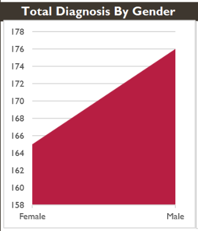

# Hospital-Based Analysis of Type 2 Diabetes Diagnosis Patterns in Awka, Nigeria
## Project Overview

This healthcare analytics project investigates the prevalence and demographic distribution of Type 2 Diabetes Mellitus using real-world hospital diagnosis data collected from Amaku Teaching Hospital, Awka, Anambra State, Nigeria.

The project was inspired by a lecture on Diabetes Mellitus delivered by Dr. Nosa Osakue during my studies in Medical Laboratory Science at Nnamdi Azikiwe University.

Motivated by global findings from the World Health Organization (WHO) regarding age and gender patterns in diabetes prevalence, I sought to examine whether similar trends existed within a local Nigerian hospital population using real clinical data rather than publicly available datasets.

---

## Background

According to WHO findings, Type 2 Diabetes tends to affect males more during younger and middle ages, while prevalence among females increases significantly at older ages, especially after menopause.

This project aimed to investigate:
- Whether local hospital data reflects similar demographic patterns
- The distribution of diabetes across age groups and gender
- Economic and hospitalization impacts associated with diabetes diagnosis

---

## Data Collection

Data was obtained from diagnosis records at Amaku Teaching Hospital, Awka, covering 2023 and early 2024.

The original dataset contained diagnosis records for multiple medical conditions including:
- Diabetes Mellitus
- Asthma
- Influenza
- Hypertension &
- Malaria

The records were unstructured and required extensive manual processing.

### Data Processing Steps

- Manually entered and organized over 1,500 hospital records into Excel
- Extracted 341 Type 2 Diabetes diagnosis cases
- Identified 256 distinct patients
- Cleaned and standardized records
- Removed incomplete or unclear entries to minimize bias
- Categorized patients into age groups:
  - Young (≤30)
  - Middle Age (30–55)
  - Old Age (>55)

---

## Tools Used

- Microsoft Excel
- Pivot Tables
- Data Cleaning & Standardization
- Data Visualization
- Healthcare Data Analysis

---

## Key Findings

### Gender Distribution
- Males showed higher prevalence overall during younger and middle ages
- Female prevalence increased after middle age and exceeded male prevalence during older age groups
- Findings aligned closely with WHO observations regarding post-menopausal diabetes trends

### Age Distribution
- 49% of diagnoses occurred in older adults
- 29% occurred in younger individuals
- 22% occurred in middle-aged individuals

### Hospitalization & Economic Impact
- Average treatment cost: ₦50,655
- Average hospitalization duration: 14 days
- Estimated hospital revenue from diabetes-related treatment exceeded ₦17.2 million within extracted records

---

# Dashboard Preview

## Dashboard Overview

---

## Gender-Based Analysis

---

## Age Group Distribution

---

## Public Health Insights

This project highlights the growing burden of diabetes within local healthcare systems and reinforces the importance of:
- Early screening
- Lifestyle modification
- Routine glucose monitoring
- Public health awareness
- Preventive healthcare strategies

For non-diabetic individuals:
Healthy eating, regular physical activity, and routine medical checkups remain important preventive measures.

For diabetic patients:
Medication adherence, glucose monitoring, exercise, and proper dietary management are essential in reducing complications.

---

## Limitations

- Dataset represents records from a single healthcare institution
- Only Type 2 Diabetes diagnoses with clear documentation were analyzed
- Findings may not fully represent the entire regional population

---

## Author

Osi Chidera John  
Medical Laboratory Science Student  
Nnamdi Azikiwe University, Awka, Nigeria

---

## View Project
[View Here](https://github.com/Osi-Chidera-John/Real-World-Analysis-of-Type-2-Diabetes-Trends-in-Awka-Nigeria/blob/main/Diabetes_Dashboard.xlsx)

---

## Acknowledgements

Special appreciation to:
- Dr. Nosa Osakue for inspiring the research direction
- Amaku Teaching Hospital, Awka
- World Health Organization (WHO) publications on Diabetes Mellitus

---

## License

This project is intended strictly for educational, research, and portfolio purposes.

---
## Linkedln Profile
[View Profile](www.linkedin.com/in/john-chidera-jr-0b6b55319)
